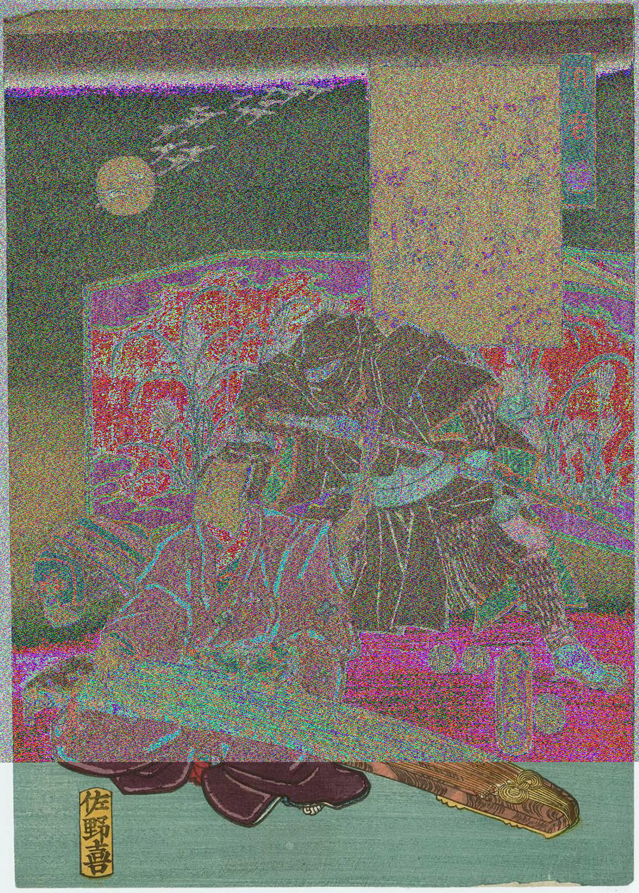

# CSOC Week 1 Forensics

### Challenge 1

---

### Information
##### Challenge Description:

Files can always be changed in a secret way. Can you find the flag?

[cat.jpg](cat.jpg)

##### Writeup:
First we use `file` command to see the type of file.
```shell
┌──(rinshu㉿kali)-[~/Downloads]
└─$ file cat.jpg
cat.jpg: JPEG image data, JFIF standard 1.02, aspect ratio, density 1x1, segment length 16, baseline, precision 8, 2560x1598, components 3
```
As we can see this is JPEG format and nothing is interesting here.

Now,we see the metadata of this file using `exiftool`.This tool helps us to read,write and edit metadata.
```shell
┌──(rinshu㉿kali)-[~/Downloads]
└─$ exiftool cat.jpg                                             
ExifTool Version Number         : 12.76
File Name                       : cat.jpg
Directory                       : .
File Size                       : 878 kB
File Modification Date/Time     : 2024:06:05 22:47:17+05:30
File Access Date/Time           : 2024:06:05 22:47:17+05:30
File Inode Change Date/Time     : 2024:06:05 22:47:17+05:30
File Permissions                : -rw-rw-r--
File Type                       : JPEG
File Type Extension             : jpg
MIME Type                       : image/jpeg
JFIF Version                    : 1.02
Resolution Unit                 : None
X Resolution                    : 1
Y Resolution                    : 1
Current IPTC Digest             : 7a78f3d9cfb1ce42ab5a3aa30573d617
Copyright Notice                : PicoCTF
Application Record Version      : 4
XMP Toolkit                     : Image::ExifTool 10.80
License                         : cGljb0NURnt0aGVfbTN0YWRhdGFfMXNfbW9kaWZpZWR9
Rights                          : PicoCTF
Image Width                     : 2560
Image Height                    : 1598
Encoding Process                : Baseline DCT, Huffman coding
Bits Per Sample                 : 8
Color Components                : 3
Y Cb Cr Sub Sampling            : YCbCr4:2:0 (2 2)
Image Size                      : 2560x1598
Megapixels                      : 4.1

```
Here everything is right but the thing here is License which is little bit weird.The license string doesn't look like license.This is the mixture of uppercase lowercase letters,number.

May be this is a base64 encoded data.

We can decode this string using `base64` command with `-d` parameter to decode.

First we print the string using `echo` command and then use `base64 -d`

```shell
┌──(rinshu㉿kali)-[~/Downloads]
└─$ echo cGljb0NURnt0aGVfbTN0YWRhdGFfMXNfbW9kaWZpZWR9 | base64 -d
picoCTF{the_m3tadata_1s_modified}  
```
And here we got our flag as **`picoCTF{the_m3tadata_1s_modified}`**

---

### Matryoshka doll
##### Challenge Desrciption:
Matryoshka dolls are a set of wooden dolls of decreasing size placed one inside another. What's the final one? 

Image: [this](dolls.jpg)


##### Writeup:

As challenge suggest that there is nested files here.We know that to idnetifies and extract the embedded files we use `binwalk` tool.

```shell
┌──(rinshu㉿kali)-[~/Downloads]
└─$ binwalk dolls.jpg 

DECIMAL       HEXADECIMAL     DESCRIPTION
--------------------------------------------------------------------------------
0             0x0             PNG image, 594 x 1104, 8-bit/color RGBA, non-interlaced
3226          0xC9A           TIFF image data, big-endian, offset of first image directory: 8
272492        0x4286C         Zip archive data, at least v2.0 to extract, compressed size: 378950, uncompressed size: 383938, name: base_images/2_c.jpg
651608        0x9F158         End of Zip archive, footer length: 22

```
As we can see there is a embedded file.

We use `-e` parameter to extract with `binwalk` tool to extract the embedded file.

```shell
┌──(rinshu㉿kali)-[~/Downloads]
└─$ binwalk -e dolls.jpg       

DECIMAL       HEXADECIMAL     DESCRIPTION
--------------------------------------------------------------------------------
0             0x0             PNG image, 594 x 1104, 8-bit/color RGBA, non-interlaced
3226          0xC9A           TIFF image data, big-endian, offset of first image directory: 8
272492        0x4286C         Zip archive data, at least v2.0 to extract, compressed size: 378950, uncompressed size: 383938, name: base_images/2_c.jpg
651608        0x9F158         End of Zip archive, footer length: 22

                                                                                                                                                                                             
┌──(rinshu㉿kali)-[~/Downloads]
└─$ ls
_dolls.jpg.extracted  cat.jpeg  cat.jpg  dolls.jpg  download.jpeg  google-chrome-stable_current_amd64.deb  t.txt  x.bin
```
As we can see after extracting we got a new directory `_dolls.jpg.extracted`.

Lets explore this directory.
```shell
┌──(rinshu㉿kali)-[~/Downloads]
└─$ cd _dolls.jpg.extracted  
                                                                                                                                                                                             
┌──(rinshu㉿kali)-[~/Downloads/_dolls.jpg.extracted]
└─$ ls
4286C.zip  base_images
                                                                                                                                                                                             
┌──(rinshu㉿kali)-[~/Downloads/_dolls.jpg.extracted]
└─$ cd base_images         
                                                                                                                                                                                             
┌──(rinshu㉿kali)-[~/Downloads/_dolls.jpg.extracted/base_images]
└─$ ls
2_c.jpg

```
Here there is another image file which we extract from the initial one.

Now we do the same again, use `binwalk -e` command again and again till we get the flag.

```shell
──(rinshu㉿kali)-[~/Downloads/_dolls.jpg.extracted/base_images]
└─$ binwalk -e 2_c.jpg  

DECIMAL       HEXADECIMAL     DESCRIPTION
--------------------------------------------------------------------------------
0             0x0             PNG image, 526 x 1106, 8-bit/color RGBA, non-interlaced
3226          0xC9A           TIFF image data, big-endian, offset of first image directory: 8
187707        0x2DD3B         Zip archive data, at least v2.0 to extract, compressed size: 196043, uncompressed size: 201445, name: base_images/3_c.jpg
383805        0x5DB3D         End of Zip archive, footer length: 22
383916        0x5DBAC         End of Zip archive, footer length: 22

                                                                                                                                                                                             
┌──(rinshu㉿kali)-[~/Downloads/_dolls.jpg.extracted/base_images]
└─$ ls                
2_c.jpg  _2_c.jpg.extracted
                                                                                                                                                                                             
┌──(rinshu㉿kali)-[~/Downloads/_dolls.jpg.extracted/base_images]
└─$ cd _2_c.jpg.extracted  
                                                                                                                                                                                             
┌──(rinshu㉿kali)-[~/Downloads/_dolls.jpg.extracted/base_images/_2_c.jpg.extracted]
└─$ ls
2DD3B.zip  base_images
                                                                                                                                                                                             
┌──(rinshu㉿kali)-[~/Downloads/_dolls.jpg.extracted/base_images/_2_c.jpg.extracted]
└─$ cd base_images       
                                                                                                                                                                                             
┌──(rinshu㉿kali)-[~/…/_dolls.jpg.extracted/base_images/_2_c.jpg.extracted/base_images]
└─$ ls
3_c.jpg
                                                                                                                                                                                             
┌──(rinshu㉿kali)-[~/…/_dolls.jpg.extracted/base_images/_2_c.jpg.extracted/base_images]
└─$ binwalk -e 3_c.jpg 

DECIMAL       HEXADECIMAL     DESCRIPTION
--------------------------------------------------------------------------------
0             0x0             PNG image, 428 x 1104, 8-bit/color RGBA, non-interlaced
3226          0xC9A           TIFF image data, big-endian, offset of first image directory: 8
123606        0x1E2D6         Zip archive data, at least v2.0 to extract, compressed size: 77651, uncompressed size: 79809, name: base_images/4_c.jpg
201423        0x312CF         End of Zip archive, footer length: 22

                                                                                                                                                                                             
┌──(rinshu㉿kali)-[~/…/_dolls.jpg.extracted/base_images/_2_c.jpg.extracted/base_images]
└─$ ls
3_c.jpg  _3_c.jpg.extracted
                                                                                                                                                                                             
┌──(rinshu㉿kali)-[~/…/_dolls.jpg.extracted/base_images/_2_c.jpg.extracted/base_images]
└─$ cd _3_c.jpg.extracted 
                                                                                                                                                                                             
┌──(rinshu㉿kali)-[~/…/base_images/_2_c.jpg.extracted/base_images/_3_c.jpg.extracted]
└─$ ls
1E2D6.zip  base_images
                                                                                                                                                                                             
┌──(rinshu㉿kali)-[~/…/base_images/_2_c.jpg.extracted/base_images/_3_c.jpg.extracted]
└─$ cd base_images       
                                                                                                                                                                                             
┌──(rinshu㉿kali)-[~/…/_2_c.jpg.extracted/base_images/_3_c.jpg.extracted/base_images]
└─$ ls
4_c.jpg
                                                                                                                                                                                             
┌──(rinshu㉿kali)-[~/…/_2_c.jpg.extracted/base_images/_3_c.jpg.extracted/base_images]
└─$ binwalk -e 4_c.jpg 

DECIMAL       HEXADECIMAL     DESCRIPTION
--------------------------------------------------------------------------------
0             0x0             PNG image, 320 x 768, 8-bit/color RGBA, non-interlaced
3226          0xC9A           TIFF image data, big-endian, offset of first image directory: 8
79578         0x136DA         Zip archive data, at least v2.0 to extract, compressed size: 65, uncompressed size: 81, name: flag.txt
79787         0x137AB         End of Zip archive, footer length: 22

                                                                                                                                                                                             
┌──(rinshu㉿kali)-[~/…/_2_c.jpg.extracted/base_images/_3_c.jpg.extracted/base_images]
└─$ ls
4_c.jpg  _4_c.jpg.extracted
                                                                                                                                                                                             
┌──(rinshu㉿kali)-[~/…/_2_c.jpg.extracted/base_images/_3_c.jpg.extracted/base_images]
└─$ cd _4_c.jpg.extracted 
                                                                                                                                                                                             
┌──(rinshu㉿kali)-[~/…/base_images/_3_c.jpg.extracted/base_images/_4_c.jpg.extracted]
└─$ ls
136DA.zip  flag.txt
```
After extracting the file from multiple images, finally we get our flag file.

Catenate this to get the flag.
```shell
┌──(rinshu㉿kali)-[~/…/base_images/_3_c.jpg.extracted/base_images/_4_c.jpg.extracted]
└─$ cat flag.txt         
picoCTF{4f11048e83ffc7d342a15bd2309b47de}
```
Here we got our flag as **`picoCTF{4f11048e83ffc7d342a15bd2309b47de}`**.

---

### tunn3l v1s10n

##### Challenge Description
We found this [file](tunn3l_v1s10n (1)). Recover the flag.

##### Writeup:

After Downloading the file we open it using image viewer.

Here the image can't be open as image viewer shows that BMP image has unsupported header size.


It means that there is something error in hex value of Bitmap header format.

We have to check the hexvalue of file and edit it with `hexedit` command.

First we see the format of hex values i.e. signature,size of file,offset,etc. of BMP file on google.


As this searching suggests that how much bytes particular function take.From this information we can easily identify which byte is dedicated to which function.

Now we check the hexvalue of the file and edit it where needed using `hexedit` command.
```shell
┌──(rinshu㉿kali)-[~/Downloads]
└─$ hexedit tunn3l_v1s10n1

```


Here the signature is correct `42 4D`. The offset mainly have 54 bytes value(36 00 00 00),but here it is not correct so we change `BA D0` to `36 00`.

There are more errors in this.The header size must be of 40 bytes (28 00 00 00).

After modifying the hex value we save this by pressing **F2** key.


After this we check the image again in image viewer.
Now the image is showing but we don't get the flag as this flag is fake, but the image seems like it is more.


We have to increase the height of image using `hexedit` again.

We can easily identify where the height value is, using above reference.
we change `32 01` to a increased size,let `32 04` and press F2.


If we open our Image now it gives us the flag although the height of image is not perfect but doesn't matter.


Here we got our flag as **`picoCTF{qu1t3_a_v13w_2020}`**

---

### MacroHard WeakEdge

##### Challenge Description:
I've hidden a flag in this file. Can you find it? 

[Forensics is fun.pptm](https://github.com/Divyanshukumar20/Writeups/blob/main/Writeup_files/Forensics%20is%20fun.pptm)

##### Writeup:
As we can see this file have extension .pptm so first we check the type of file using `file` command.
```shell
┌──(rinshu㉿kali)-[~/Downloads]
└─$ file 'Forensics is fun.pptm'
Forensics is fun.pptm: Microsoft PowerPoint 2007+
```
It is a powerpoint file so we open it using Microsoft Powerpoint to find the flag.

But we finds nothing interesting in powerpoint.
So we try to find the hiddden files inside the file.

We try to unzip the file using `unzip` command to get the files hidden in it.
```shell
┌──(rinshu㉿kali)-[~/Downloads]
└─$ unzip 'Forensics is fun.pptm' 
Archive:  Forensics is fun.pptm
  inflating: [Content_Types].xml     
  inflating: _rels/.rels             
  inflating: ppt/presentation.xml    
  inflating: ppt/slides/_rels/slide46.xml.rels  
  inflating: ppt/slides/slide1.xml   
  ....
  inflating: ppt/vbaProject.bin      
  inflating: ppt/presProps.xml       
  inflating: ppt/viewProps.xml       
  inflating: ppt/tableStyles.xml     
  inflating: docProps/core.xml       
  inflating: docProps/app.xml        
  inflating: ppt/slideMasters/hidden 
```
After extracting we get so many files but all .xml and .rels files are not of our use because this are powerpoint files.

Also if we see the last file which is unzip have name hidden.
So there may be a chance of hidden flag inside it.

If we try to catenate this file

```shell
┌──(rinshu㉿kali)-[~/Downloads]
└─$ cat ppt/slideMasters/hidden
Z m x h Z z o g c G l j b 0 N U R n t E M W R f d V 9 r b j B 3 X 3 B w d H N f c l 9 6 M X A 1 f Q     
```
We get a text which maybe a encode flag text.

First we remove the spaces between the alphabet and then we try to decode this text using `base64`.
```shell
┌──(rinshu㉿kali)-[~/Downloads]
└─$ echo ZmxhZzogcGljb0NURntEMWRfdV9rbjB3X3BwdHNfcl96MXA1fQ | base64 -d
flag: picoCTF{D1d_u_kn0w_ppts_r_z1p5}base64: invalid input

```
Thus, We get our flag as **`picoCTF{D1d_u_kn0w_ppts_r_z1p5}`**

---

### Enhance!
##### Challenge Description:

Download this image file and find the flag.

[Download image file](drawing.flag.svg)

##### Writeup:

After downlaoding this svg file, first we open this file in a image viewer but we see nothing here.

Then we check the file type using `file` command.
```shell
┌──(rinshu㉿kali)-[~/Downloads]
└─$ file drawing.flag.svg 
drawing.flag.svg: SVG Scalable Vector Graphics image

```
It shows simple svg file.No hint at all.

Now we see the metadata of this file using `exiftool` to get some hints.
```shell
┌──(rinshu㉿kali)-[~/Downloads]
└─$ exiftool drawing.flag.svg 
ExifTool Version Number         : 12.76
File Name                       : drawing.flag.svg
Directory                       : .
File Size                       : 4.1 kB
File Modification Date/Time     : 2024:06:07 00:12:11+05:30
File Access Date/Time           : 2024:06:07 00:12:12+05:30
File Inode Change Date/Time     : 2024:06:07 00:12:12+05:30
File Permissions                : -rw-rw-r--
File Type                       : SVG
File Type Extension             : svg
MIME Type                       : image/svg+xml
Xmlns                           : http://www.w3.org/2000/svg
Image Width                     : 210mm
Image Height                    : 297mm
View Box                        : 0 0 210 297
SVG Version                     : 1.1
ID                              : svg8
Version                         : 0.92.5 (2060ec1f9f, 2020-04-08)
Docname                         : drawing.svg
Metadata ID                     : metadata5
Work Format                     : image/svg+xml
Work Type                       : http://purl.org/dc/dcmitype/StillImage
Work Title                      : 

```
Everything is fine but here the Work Format shows svg+xml means this is a xml file.

It means we can see the code of xml language using `cat` command.

```shell
┌──(rinshu㉿kali)-[~/Downloads]
└─$ cat drawing.flag.svg                 
<?xml version="1.0" encoding="UTF-8" standalone="no"?>
<!-- Created with Inkscape (http://www.inkscape.org/) -->

<svg
   xmlns:dc="http://purl.org/dc/elements/1.1/"
   xmlns:cc="http://creativecommons.org/ns#"
   xmlns:rdf="http://www.w3.org/1999/02/22-rdf-syntax-ns#"
   xmlns:svg="http://www.w3.org/2000/svg"
   xmlns="http://www.w3.org/2000/svg"
   xmlns:sodipodi="http://sodipodi.sourceforge.net/DTD/sodipodi-0.dtd"
   xmlns:inkscape="http://www.inkscape.org/namespaces/inkscape"
   width="210mm"
   height="297mm"
   viewBox="0 0 210 297"
   version="1.1"
   id="svg8"
   inkscape:version="0.92.5 (2060ec1f9f, 2020-04-08)"
   sodipodi:docname="drawing.svg">
  <defs
     id="defs2" />
  <sodipodi:namedview
     id="base"
     pagecolor="#ffffff"
     bordercolor="#666666"
     borderopacity="1.0"
     inkscape:pageopacity="0.0"
     inkscape:pageshadow="2"
     inkscape:zoom="0.69833333"
     inkscape:cx="400"
     inkscape:cy="538.41159"
     inkscape:document-units="mm"
     inkscape:current-layer="layer1"
     showgrid="false"
     inkscape:window-width="1872"
     inkscape:window-height="1016"
     inkscape:window-x="48"
     inkscape:window-y="27"
     inkscape:window-maximized="1" />
  <metadata
     id="metadata5">
    <rdf:RDF>
      <cc:Work
         rdf:about="">
        <dc:format>image/svg+xml</dc:format>
        <dc:type
           rdf:resource="http://purl.org/dc/dcmitype/StillImage" />
        <dc:title></dc:title>
      </cc:Work>
    </rdf:RDF>
  </metadata>
  <g
     inkscape:label="Layer 1"
     inkscape:groupmode="layer"
     id="layer1">
    <ellipse
       id="path3713"
       cx="106.2122"
       cy="134.47203"
       rx="102.05357"
       ry="99.029755"
       style="stroke-width:0.26458332" />
    <circle
       style="fill:#ffffff;stroke-width:0.26458332"
       id="path3717"
       cx="107.59055"
       cy="132.30211"
       r="3.3341289" />
    <ellipse
       style="fill:#000000;stroke-width:0.26458332"
       id="path3719"
       cx="107.45217"
       cy="132.10078"
       rx="0.027842503"
       ry="0.031820003" />
    <text
       xml:space="preserve"
       style="font-style:normal;font-weight:normal;font-size:0.00352781px;line-height:1.25;font-family:sans-serif;letter-spacing:0px;word-spacing:0px;fill:#ffffff;fill-opacity:1;stroke:none;stroke-width:0.26458332;"
       x="107.43014"
       y="132.08501"
       id="text3723"><tspan
         sodipodi:role="line"
         x="107.43014"
         y="132.08501"
         style="font-size:0.00352781px;line-height:1.25;fill:#ffffff;stroke-width:0.26458332;"
         id="tspan3748">p </tspan><tspan
         sodipodi:role="line"
         x="107.43014"
         y="132.08942"
         style="font-size:0.00352781px;line-height:1.25;fill:#ffffff;stroke-width:0.26458332;"
         id="tspan3754">i </tspan><tspan
         sodipodi:role="line"
         x="107.43014"
         y="132.09383"
         style="font-size:0.00352781px;line-height:1.25;fill:#ffffff;stroke-width:0.26458332;"
         id="tspan3756">c </tspan><tspan
         sodipodi:role="line"
         x="107.43014"
         y="132.09824"
         style="font-size:0.00352781px;line-height:1.25;fill:#ffffff;stroke-width:0.26458332;"
         id="tspan3758">o </tspan><tspan
         sodipodi:role="line"
         x="107.43014"
         y="132.10265"
         style="font-size:0.00352781px;line-height:1.25;fill:#ffffff;stroke-width:0.26458332;"
         id="tspan3760">C </tspan><tspan
         sodipodi:role="line"
         x="107.43014"
         y="132.10706"
         style="font-size:0.00352781px;line-height:1.25;fill:#ffffff;stroke-width:0.26458332;"
         id="tspan3762">T </tspan><tspan
         sodipodi:role="line"
         x="107.43014"
         y="132.11147"
         style="font-size:0.00352781px;line-height:1.25;fill:#ffffff;stroke-width:0.26458332;"
         id="tspan3764">F { 3 n h 4 n </tspan><tspan
         sodipodi:role="line"
         x="107.43014"
         y="132.11588"
         style="font-size:0.00352781px;line-height:1.25;fill:#ffffff;stroke-width:0.26458332;"
         id="tspan3752">c 3 d _ d 0 a 7 5 7 b f }</tspan></text>
  </g>
</svg>

```
Yes,we are correct this file store a xml code with svg code inside it.Now if analyze the code written in `<text>` tag then we can see our flag.

In every `<tspan>` tag there is a alphabet, combining this all we get the flag.


Thus our flag is **`picoCTF{3nh4nc3d_d0a757bf}`**

---

### advance-potion-making

##### Challenge Description:
Ron just found his own copy of advanced potion making, but its been corrupted by some kind of spell. Help him recover it!

[advance-potion-making](advance-potion-making)

##### Writeup:
After downlaoding we check the file type using `file` command.
```shell
┌──(rinshu㉿kali)-[~/Downloads]
└─$ file advanced-potion-making
advanced-potion-making: data

```
We get nothing interesting here.

Let's try `exiftool` to get the metadata of the file.

```shell
┌──(rinshu㉿kali)-[~/Downloads]
└─$ exiftool advanced-potion-making
ExifTool Version Number         : 12.76
File Name                       : advanced-potion-making
Directory                       : .
File Size                       : 30 kB
File Modification Date/Time     : 2024:06:07 01:36:23+05:30
File Access Date/Time           : 2024:06:07 01:36:24+05:30
File Inode Change Date/Time     : 2024:06:07 01:36:24+05:30
File Permissions                : -rw-rw-r--
Error                           : Unknown file type
                    
```
Here also we see nothing much as this is unknown file type.

Let's check the hexdata of the file using `xxd` command to identify the file type.

```shell
┌──(rinshu㉿kali)-[~/Downloads]
└─$ xxd advanced-potion-making  
00000000: 8950 4211 0d0a 1a0a 0012 1314 4948 4452  .PB.........IHDR
00000010: 0000 0990 0000 04d8 0802 0000 0004 2de7  ..............-.
00000020: 7800 0000 0173 5247 4200 aece 1ce9 0000  x....sRGB.......
00000030: 0004 6741 4d41 0000 b18f 0bfc 6105 0000  ..gAMA......a...
00000040: 0009 7048 5973 0000 1625 0000 1625 0149  ..pHYs...%...%.I

```
The signature (89 50 42 11) is not known to any type of file but it is similar to png signature (89 50 4E 47).Also there is IHDR,sRGB,gAMA written in strings which gives us hint that it can be a png image file.

We change the hex values to png signature using `hexedit` command.
The new hex values are:
```shell
┌──(rinshu㉿kali)-[~/Downloads]
└─$ xxd advanced-potion-making
00000000: 8950 4e47 0d0a 1a0a 0012 1314 4948 4452  .PNG........IHDR
00000010: 0000 0990 0000 04d8 0802 0000 0004 2de7  ..............-.
00000020: 7800 0000 0173 5247 4200 aece 1ce9 0000  x....sRGB.......
00000030: 0004 6741 4d41 0000 b18f 0bfc 6105 0000  ..gAMA......a...
00000040: 0009 7048 5973 0000 1625 0000 1625 0149  ..pHYs...%...%.I
```
But still if we try to open the image using image viewer it shows us *Invalid IHDR length*.


After some google we got to know that the Length of IHDR have this format (00 00 00 0D) and located in 13 bytes.

So we again change the Hexvalue using `hexedit` command and got the new hex value as:

```shell
┌──(rinshu㉿kali)-[~/Downloads]
└─$ xxd advanced-potion-making
00000000: 8950 4e47 0d0a 1a0a 0000 000d 4948 4452  .PNG........IHDR
00000010: 0000 0990 0000 04d8 0802 0000 0004 2de7  ..............-.
00000020: 7800 0000 0173 5247 4200 aece 1ce9 0000  x....sRGB.......
00000030: 0004 6741 4d41 0000 b18f 0bfc 6105 0000  ..gAMA......a...
00000040: 0009 7048 5973 0000 1625 0000 1625 0149  ..pHYs...%...%.I

```

Now the image is open in image viewer but it seems it doesn't contain flag.


May be we can check this image in different planes and get the flag.

To do this we use `stegsolve` tool.


After checking in multiple planes.

Finally we get our flag in Red plane 0 as **`picoCTF{w1z4rdry}`**.

---

### File types

##### Challenge Description:
This file was found among some files marked confidential but my pdf reader cannot read it, maybe yours can.

You can download the file from [here](Flag.pdf).

##### writeup:
After downloading the file we see that it can't be open using any pdf viewer, maybe it is of different file type.

First we check the type of file using `file` command.

```shell
┌──(rinshu㉿kali)-[~/Downloads]
└─$ file Flag.pdf 
Flag.pdf: shell archive text

```
It is a shell archive text which means it a contains a executable script which we see using `cat` command.
```shell
┌──(rinshu㉿kali)-[~/Downloads]
└─$ cat Flag.pdf
#!/bin/sh
# This is a shell archive (produced by GNU sharutils 4.15.2).
# To extract the files from this archive, save it to some FILE, remove
# everything before the '#!/bin/sh' line above, then type 'sh FILE'.
#
lock_dir=_sh00046
# Made on 2023-03-16 01:40
.....
then ${echo} "x - removed lock directory ${lock_dir}."
else ${echo} "x - failed to remove lock directory ${lock_dir}."
     exit 1
fi
exit 0

```
To run this program we change the extension of the file from **.pdf** to **.sh** and give it permission to run and then run the file.

```shell
┌──(rinshu㉿kali)-[~/Downloads]
└─$ mv Flag.pdf Flag.sh 
       
┌──(rinshu㉿kali)-[~/Downloads]
└─$ chmod +x Flag.sh
     
┌──(rinshu㉿kali)-[~/Downloads]
└─$ ./Flag.sh
x - created lock directory _sh00046.
x - extracting flag (text)
x - removed lock directory _sh00046.

┌──(rinshu㉿kali)-[~/Downloads]
└─$ ls
Flag.sh  download.jpeg  flag  google-chrome-stable_current_amd64.deb  stegsolve

```
It gives us another file name as flag.

We check file type first using `file` command.

```shell
┌──(rinshu㉿kali)-[~/Downloads]
└─$ file flag    
flag: current ar archive

```
Since this is ar archive so we extract file using `ar` command.

And check again the file type of extracted file.

```shell
┌──(rinshu㉿kali)-[~/Downloads]
└─$ file flag    
flag: current ar archive
       
┌──(rinshu㉿kali)-[~/Downloads]
└─$ ar -x flag
       
┌──(rinshu㉿kali)-[~/Downloads]
└─$ ls
Flag.sh  download.jpeg  flag  google-chrome-stable_current_amd64.deb  stegsolve
    
┌──(rinshu㉿kali)-[~/Downloads]
└─$ file flag
flag: cpio archive

```
We can extract the file from this cpio archive using `binwalk` tool.
```shell
┌──(rinshu㉿kali)-[~/Downloads]
└─$ binwalk -e flag

DECIMAL       HEXADECIMAL     DESCRIPTION
--------------------------------------------------------------------------------
32            0x20            bzip2 compressed data, block size = 900k

      
┌──(rinshu㉿kali)-[~/Downloads]
└─$ ls
Flag.sh  _flag.extracted  download.jpeg  flag  google-chrome-stable_current_amd64.deb  stegsolve
                                                                                                       
```
We see a new directory created by binwalk.Let's explore it.

```shell
┌──(rinshu㉿kali)-[~/Downloads]
└─$ cd _flag.extracted  
       
┌──(rinshu㉿kali)-[~/Downloads/_flag.extracted]
└─$ ls
20
       
┌──(rinshu㉿kali)-[~/Downloads/_flag.extracted]
└─$ file 20  
20: gzip compressed data, was "flag", last modified: Thu Mar 16 01:40:19 2023, from Unix, original size modulo 2^32 328

```
Since the file in this directory is gzip compressed,we can decompress it using `gzip` command. But first we have to give it `.gz` extension.

```shell
┌──(rinshu㉿kali)-[~/Downloads/_flag.extracted]
└─$ mv 20 20.gz         
       
┌──(rinshu㉿kali)-[~/Downloads/_flag.extracted]
└─$ gzip -d 20.gz
       
┌──(rinshu㉿kali)-[~/Downloads/_flag.extracted]
└─$ file 20
20: lzip compressed data, version: 1

```
After decompressing the file we got another file named as 20.This is also a compressed file using lzip.

So we do the same thing again, changing the extension of the file,decompress it with proper zip command.

```shell
┌──(rinshu㉿kali)-[~/Downloads/_flag.extracted]
└─$ mv 20 20.lz  
       
┌──(rinshu㉿kali)-[~/Downloads/_flag.extracted]
└─$ lzip -d 20.lz  
       
┌──(rinshu㉿kali)-[~/Downloads/_flag.extracted]
└─$ ls           
20
       
┌──(rinshu㉿kali)-[~/Downloads/_flag.extracted]
└─$ file 20
20: LZ4 compressed data (v1.4+)
       
┌──(rinshu㉿kali)-[~/Downloads/_flag.extracted]
└─$ mv 20 20.lz4                
       
┌──(rinshu㉿kali)-[~/Downloads/_flag.extracted]
└─$ lz4 -d 20.lz4
Decoding file 20 
20.lz4               : decoded 264 bytes                                       
       
┌──(rinshu㉿kali)-[~/Downloads/_flag.extracted]
└─$ ls           
20  20.lz4

┌──(rinshu㉿kali)-[~/Downloads/_flag.extracted]
└─$ file 20
20: LZMA compressed data, non-streamed, size 253                                                                                                                      
┌──(rinshu㉿kali)-[~/Downloads/_flag.extracted]
└─$ mv 20 20.lzma                                                                                                                                                                                                
┌──(rinshu㉿kali)-[~/Downloads/_flag.extracted]
└─$ lzma -d 20.lzma
       
┌──(rinshu㉿kali)-[~/Downloads/_flag.extracted]
└─$ ls             
20  20.lz4
       
┌──(rinshu㉿kali)-[~/Downloads/_flag.extracted]
└─$ file 20
20: lzop compressed data - version 1.040, LZO1X-1, os: Unix
       
┌──(rinshu㉿kali)-[~/Downloads/_flag.extracted]
└─$ mv 20 20.lzop
       
┌──(rinshu㉿kali)-[~/Downloads/_flag.extracted]
└─$ lzop -d 20.lzop

┌──(rinshu㉿kali)-[~/Downloads/_flag.extracted]
└─$ ls 
20  20.lz4  20.lzop
       
┌──(rinshu㉿kali)-[~/Downloads/_flag.extracted]
└─$ file 20
20: lzip compressed data, version: 1
       
┌──(rinshu㉿kali)-[~/Downloads/_flag.extracted]
└─$ mv 20 20.lz  
       
┌──(rinshu㉿kali)-[~/Downloads/_flag.extracted]
└─$ lzip -d 20.lz  
       
┌──(rinshu㉿kali)-[~/Downloads/_flag.extracted]
└─$ ls           
20  20.lz4  20.lzop
       
┌──(rinshu㉿kali)-[~/Downloads/_flag.extracted]
└─$ file 20
20: XZ compressed data, checksum CRC64
       
┌──(rinshu㉿kali)-[~/Downloads/_flag.extracted]
└─$ mv 20 20.xz
       
┌──(rinshu㉿kali)-[~/Downloads/_flag.extracted]
└─$ xz -d 20.xz 
       
┌──(rinshu㉿kali)-[~/Downloads/_flag.extracted]
└─$ ls
20  20.lz4  20.lzop
       
┌──(rinshu㉿kali)-[~/Downloads/_flag.extracted]
└─$ file 20
20: ASCII text

```
After decompressing the file again and again using different commands.

Finally we get a file which contains a ASCII text.

Catenate this file will give us a text.

```shell
┌──(rinshu㉿kali)-[~/Downloads/_flag.extracted]
└─$ cat 20            
7069636f4354467b66316c656e406d335f6d406e3170756c407431306e5f
6630725f3062326375723137795f39353063346665657d0a
```
This text is not a flag but it looks like a hexadecimal type of text.

We use `xxd -r -p` to get the flag.
```shell
┌──(rinshu㉿kali)-[~/Downloads/_flag.extracted]
└─$ xxd -r -p 20
picoCTF{f1len@m3_m@n1pul@t10n_f0r_0b2cur17y_950c4fee}

```
Finally we get our flag as **`picoCTF{f1len@m3_m@n1pul@t10n_f0r_0b2cur17y_950c4fee}`**

---

### hideme

##### Challenge Description:
Every file gets a flag.

The SOC analyst saw one image been sent back and forth between two people. They decided to investigate and found out that there was more than what meets the eye [here](flag.png).

##### Writeup:
After downloading image if we open it using image viewer, it shows a simple image.

Now we check the file type of image using `file` command.
```shell
┌──(rinshu㉿kali)-[~/Downloads]
└─$ file flag.png    
flag.png: PNG image data, 512 x 504, 8-bit/color RGBA, non-interlaced

```
It shows the simple png file.

Using `exiftool` we see the metadata of the image.
```shell
┌──(rinshu㉿kali)-[~/Downloads]
└─$ exiftool flag.png
ExifTool Version Number         : 12.76
File Name                       : flag.png
Directory                       : .
File Size                       : 43 kB
File Modification Date/Time     : 2024:06:07 12:44:11+05:30
File Access Date/Time           : 2024:06:07 12:44:31+05:30
File Inode Change Date/Time     : 2024:06:07 12:44:31+05:30
File Permissions                : -rw-rw-r--
File Type                       : PNG
File Type Extension             : png
MIME Type                       : image/png
Image Width                     : 512
Image Height                    : 504
Bit Depth                       : 8
Color Type                      : RGB with Alpha
Compression                     : Deflate/Inflate
Filter                          : Adaptive
Interlace                       : Noninterlaced
Warning                         : [minor] Trailer data after PNG IEND chunk
Image Size                      : 512x504
Megapixels                      : 0.258

```
It also shows us nothing interesting.

May be there is an embedded file in it.Wew check it using `binwalk` command.
```shell
┌──(rinshu㉿kali)-[~/Downloads]
└─$ binwalk flag.png   

DECIMAL       HEXADECIMAL     DESCRIPTION
--------------------------------------------------------------------------------
0             0x0             PNG image, 512 x 504, 8-bit/color RGBA, non-interlaced
41            0x29            Zlib compressed data, compressed
39739         0x9B3B          Zip archive data, at least v1.0 to extract, name: secret/
39804         0x9B7C          Zip archive data, at least v2.0 to extract, compressed size: 2959, uncompressed size: 3108, name: secret/flag.png
42998         0xA7F6          End of Zip archive, footer length: 22

```
Our assumption is right There is a zip archive data name as secret and flag.png is compressed in it.

We extract this file using `unzip` command or we can aslo use `binwalk -e` command to extarct the file or more data.

```shell
┌──(rinshu㉿kali)-[~/Downloads]
└─$ unzip flag.png
Archive:  flag.png
warning [flag.png]:  39739 extra bytes at beginning or within zipfile
  (attempting to process anyway)
   creating: secret/
  inflating: secret/flag.png

┌──(rinshu㉿kali)-[~/Downloads]
└─$ ls
download.jpeg  flag.png  google-chrome-stable_current_amd64.deb  secret  stegsolve                                                                            
```
After extracting we can see a new directory `secret`.

Let's explore this directory.

```shell
┌──(rinshu㉿kali)-[~/Downloads]
└─$ cd secret
                                                                           
┌──(rinshu㉿kali)-[~/Downloads/secret]
└─$ ls
flag.png

```
Here we can see a png image name as `flag.png`

If we open it using image viewer we can see our flag.


The flag is **`picoCTF{Hiddinng_An_imag3_within_@n_ima9e_dc2ab58f}`**

---

### MSB

##### Challenge Description:
This image passes LSB statistical analysis, but we can't help but think there must be something to the visual artifacts present in this image...

Download the image [here](https://github.com/Divyanshukumar20/Writeups/blob/main/Writeup_files/Screenshot_2024-06-07_15_29_16.png)

##### Writeup:
As challenge suggests that the image passes LSB statistical analysis but still finds nothing.

So as name of challenge suggests MSB means the flag must be hidden within the MSB(Most signifucant bit) of the PNG image.

If we check the file type and metadata , it looks normal.

```shell
──(rinshu㉿kali)-[~/Downloads]
└─$ file Ninja-and-Prince-Genji-Ukiyoe-Utagawa-Kunisada.flag.png
Ninja-and-Prince-Genji-Ukiyoe-Utagawa-Kunisada.flag.png: PNG image data, 1074 x 1500, 8-bit/color RGB, non-interlaced
         
┌──(rinshu㉿kali)-[~/Downloads]
└─$ exiftool Ninja-and-Prince-Genji-Ukiyoe-Utagawa-Kunisada.flag.png
ExifTool Version Number         : 12.76
File Name                       : Ninja-and-Prince-Genji-Ukiyoe-Utagawa-Kunisada.flag.png
Directory                       : .
File Size                       : 3.4 MB
File Modification Date/Time     : 2024:06:07 14:00:00+05:30
File Access Date/Time           : 2024:06:07 14:00:00+05:30
File Inode Change Date/Time     : 2024:06:07 14:00:00+05:30
File Permissions                : -rw-rw-r--
File Type                       : PNG
File Type Extension             : png
MIME Type                       : image/png
Image Width                     : 1074
Image Height                    : 1500
Bit Depth                       : 8
Color Type                      : RGB
Compression                     : Deflate/Inflate
Filter                          : Adaptive
Interlace                       : Noninterlaced
Image Size                      : 1074x1500
Megapixels                      : 1.6

```
Now we try to extract and decode the Most significant bits of the image. To do this we need a tool.

Searching on google we get the python tool for this specific purpose.
We download the python tool using the `wget` command on our shell.
```shell
┌──(rinshu㉿kali)-[~/Downloads]
└─$ wget https://github.com/Pulho/sigBits/raw/master/sigBits.py
--2024-06-07 15:15:41--  https://github.com/Pulho/sigBits/raw/master/sigBits.py
Resolving github.com (github.com)... 20.207.73.82
Connecting to github.com (github.com)|20.207.73.82|:443... connected.
HTTP request sent, awaiting response... 302 Found
Location: https://raw.githubusercontent.com/Pulho/sigBits/master/sigBits.py [following]
--2024-06-07 15:15:42--  https://raw.githubusercontent.com/Pulho/sigBits/master/sigBits.py
Resolving raw.githubusercontent.com (raw.githubusercontent.com)... 2606:50c0:8000::154, 2606:50c0:8003::154, 2606:50c0:8002::154, ...
Connecting to raw.githubusercontent.com (raw.githubusercontent.com)|2606:50c0:8000::154|:443... connected.
HTTP request sent, awaiting response... 200 OK
Length: 7008 (6.8K) [text/plain]
Saving to: ‘sigBits.py’

sigBits.py                                                 100%[=======================================================================================================================================>]   6.84K  --.-KB/s    in 0s      

2024-06-07 15:15:43 (26.4 MB/s) - ‘sigBits.py’ saved [7008/7008]

```
As we can there is a new file named `sigBits.py`.First we check the commands of this file that how we extract msb using this python code.

As this is a python code so we give `python` command.

```shell
┌──(rinshu㉿kali)-[~/Downloads]
└─$ python sigBits.py                                                                   
Usage:
        sbPy [OPTIONS] [FILE]

Options:
        -t=<lsb or msb>, --type=<lsb or msb>:
                Choose between read LSB or MSB (Default is LSB)

        -o=<Order sigle>, --order=<Order sigle>:
                Read the lsb or msb in the specify order (Default is RGB)

        -out=<Ouput name>, --output=<Output name>
                Choose the name of the output file (Default is outputSB)

        -e=<Row r Column>, --extract=<Row or Column>
                Choose between extracting by row or column (Default is Column)

        -b=<7 bits of your choice>, --bits=<7 bits of your choice>
                Choose the bits you want to extract info ( Have higher priority than '--type or -t' )
                                                                                                        
```

So as this manual suggests that we are going to use `-t` parameter to get the extracted or decoded file.
```shell
┌──(rinshu㉿kali)-[~/Downloads]
└─$ python sigBits.py -t=Msb Ninja-and-Prince-Genji-Ukiyoe-Utagawa-Kunisada.flag.png    
Done, check the output file!

```
It gives us the output file.

Let's check this file.

```shell
┌──(rinshu㉿kali)-[~/Downloads]
└─$ ls
Ninja-and-Prince-Genji-Ukiyoe-Utagawa-Kunisada.flag.png  download.jpeg  google-chrome-stable_current_amd64.deb  outputSB.txt  sigBits.py  stegsolve

```
This is a text file. Catenatee this file.

```shell
┌──(rinshu㉿kali)-[~/Downloads]
└─$ cat outputSB.txt
The Project Gutenberg eBook of The History of Don Quixote, by Miguel de CervantesThis eBook is for the use of anyone anywhere in the United States andmost other parts of the world at no cost and with almost no restrictionswhatsoever. You may copy it, give it away or re-use it under the termsof the Project Gutenberg License included with this eBook or online atwww.gutenberg.org. If you are not located in the United States, youwill have to check the laws of the country where you are located beforeusing
```
It gives us a very large text. Now we have to find our flag in this text.

Using `grep` command wouldn't work here as it again give the same output.

So we use `less` command here.

```shell
┌──(rinshu㉿kali)-[~/Downloads]
└─$ less outputSB.txt
```
Type 'pico' followed by / Press enter we get our flag.



Hence, We get our flag as **`picoCTF{15_y0ur_que57_qu1x071c_0r_h3r01c_572ad5fe}`**

---
